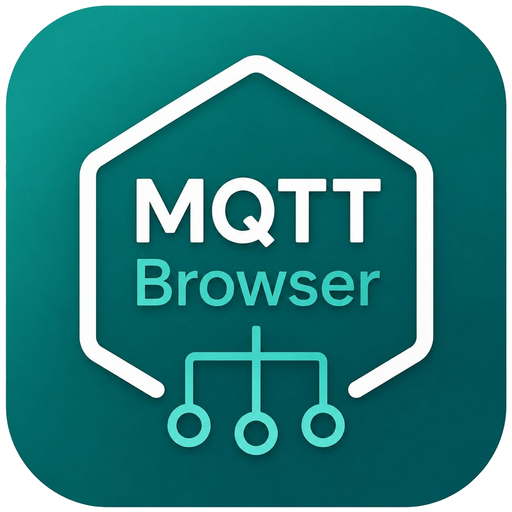
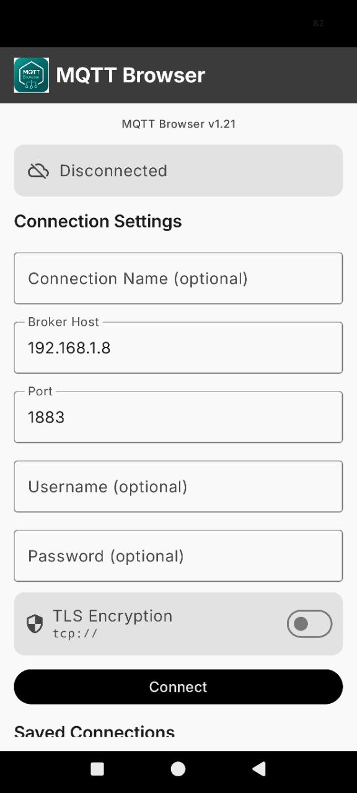
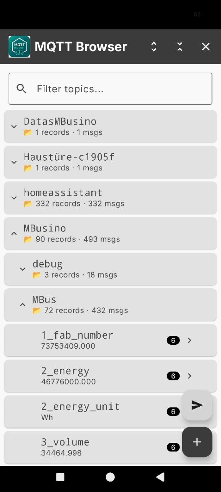
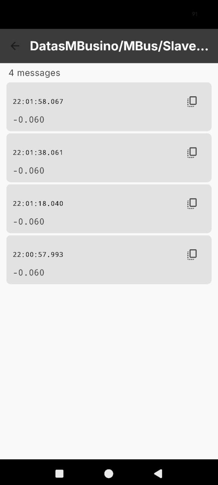

# MQTT Browser

<p align="center">
  
</p>

[](CHANGELOG.md)
[](LICENSE)

A native Android MQTT client that provides a structured topic browser with message history.

Inspired by [MQTT Explorer](https://github.com/thomasnordquist/MQTT-Explorer) by Thomas Nordquist — reimplemented as a native Android app.

## Features

- **Topic Tree** — Hierarchical, collapsible view of all MQTT topics (auto-subscribes to `#`)
- **Branch Statistics** — Parent nodes show record count and total message count across child topics
- **Message History** — Tap any topic to view the message log with timestamps (`HH:mm:ss.SSS`)
- **Live Updates** — New messages appear in real-time
- **Search & Filter** — Filter the topic tree by name
- **Subscribe / Unsubscribe** — Add wildcard subscriptions (e.g. `MBusino/#`) via FAB
- **Connection Manager** — Save and reuse broker connections (stored in SharedPreferences)
- **Auto-Reconnect** — Reconnects automatically when the app returns from background
- **Manual Reconnect** — Reconnect button when connection is lost
- **Dark Mode** — Follows system theme

| Connection | Topic Tree | Message Detail |
|:---:|:---:|:---:|
|  |  |  |

## Requirements

- Android 8.0+ (API 26)
- Any MQTT broker (tested with Mosquitto)

## Installation

Download the latest `.apk` from [Releases](../../releases) and install it. You may need to enable "Unknown sources" in your Android settings.

## Usage

1. Enter your broker address (default: `192.168.1.8:1883`)
2. Optionally enter username/password
3. Tap **Connect**
4. Browse the topic tree — tap a topic to see its message history
5. Use the **+** button to subscribe to specific topics or wildcards

## Tech Stack

- **Language:** Kotlin
- **UI:** Jetpack Compose + Material 3
- **MQTT:** Eclipse Paho MQTT Client v3 (`MqttAsyncClient`)
- **Architecture:** Single Activity, Jetpack Navigation, ViewModel per screen
- **Build:** Gradle 8.5, compileSdk 34, minSdk 26

## Project Structure

```
MQTTBrowser/
├── app/src/main/java/com/mbusino/mqttexplorer/
│   ├── MainActivity.kt              # Navigation host + lifecycle handling
│   ├── MqttExplorerApp.kt           # Application class
│   ├── mqtt/MqttManager.kt          # MQTT client wrapper (singleton)
│   ├── data/
│   │   ├── TopicNode.kt             # Topic tree model + branch stats
│   │   └── ConnectionSettings.kt    # Connection data + SharedPreferences storage
│   ├── viewmodel/
│   │   ├── ConnectionViewModel.kt   # Connection screen logic
│   │   ├── TreeViewModel.kt         # Tree screen logic
│   │   └── DetailViewModel.kt       # Detail screen logic
│   └── ui/
│       ├── theme/                    # Material 3 theme (Color, Type, Theme)
│       ├── screens/
│       │   ├── ConnectionScreen.kt   # Broker connection UI
│       │   ├── TreeScreen.kt         # Topic tree browser
│       │   └── DetailScreen.kt       # Message history view
│       └── components/
│           └── TopicTreeItem.kt      # Tree node component with branch stats
```

## Attribution & Credits

This project was **inspired by** [MQTT Explorer](https://github.com/thomasnordquist/MQTT-Explorer) by Thomas Nordquist. MQTT Explorer is a comprehensive Electron/React desktop MQTT client licensed under [CC BY-SA 4.0](https://creativecommons.org/licenses/by-sa/4.0/).

**MQTT Browser is a complete native Android rewrite** — none of the original source code was used. The concept (hierarchical topic tree, message history per topic, search/filter) comes from MQTT Explorer, but the implementation is entirely new:

| Component | Origin |
|---|---|
| Topic tree model (`TopicNode`) | Written from scratch |
| MQTT client wrapper (`MqttManager`) | Written from scratch (Eclipse Paho) |
| All UI screens (Compose) | Written from scratch (Material 3) |
| Connection storage | Written from scratch (SharedPreferences + Gson) |
| Branch statistics | New feature (not in original MQTT Explorer) |
| Auto-reconnect | New feature (not in original MQTT Explorer) |

**Concept & Requirements:** Zeppelin500  
**Design, Code & Implementation:** ZeppelinsBot (Data)

## License

This project is released under the [GNU General Public License v3.0](LICENSE).

## Changelog

See [CHANGELOG.md](CHANGELOG.md).
